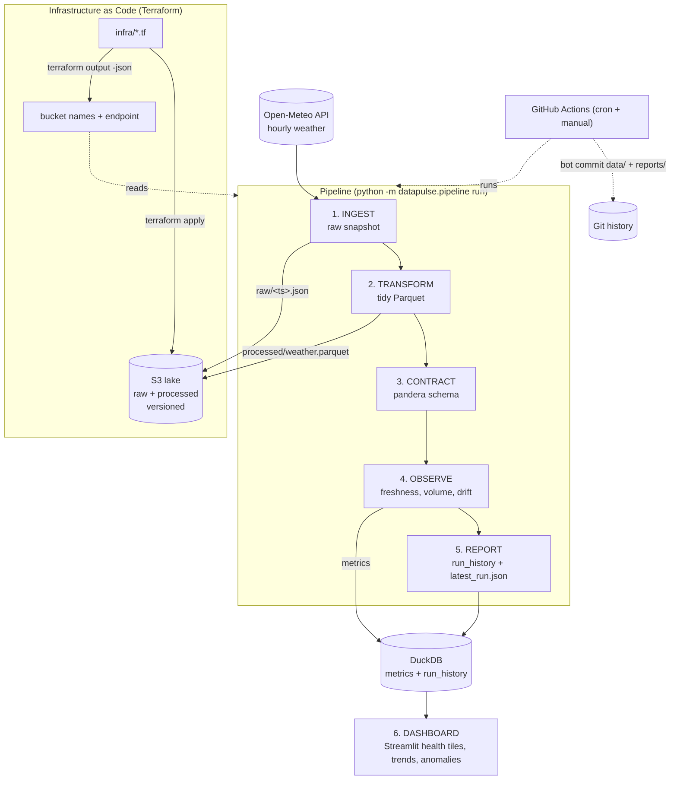

# DataPulse

[](https://github.com/knandu98/project_datapulse/actions/workflows/pipeline.yml)
[](https://www.python.org/)
[](https://www.terraform.io/)
[](https://github.com/astral-sh/ruff)

> **A data pipeline that monitors its own health.** Most pipelines break silently —
> schema changes, data stops arriving, values drift — and nobody notices until a
> dashboard looks wrong weeks later. DataPulse ingests a live public dataset on a
> schedule, validates it against a data contract, computes freshness / volume /
> schema-drift / distribution-drift / contract metrics every run, stores results in
> a **Terraform-provisioned** object-storage lake, and surfaces everything on a
> Streamlit "data health" dashboard. It runs itself via GitHub Actions on a cron, so
> the repo is a *live, continuously-running* pipeline that visibly **catches real
> problems over time**.

---

## Architecture

Code **+** data **+** infrastructure are all version-controlled. The data lake bucket
is provisioned reproducibly with Terraform (LocalStack by default — free and offline;
real AWS S3 via the same code with one flag).



**The flow (steps 1–6):**

| Step | Module | What it does |
|---|---|---|
| 0. Provision | `infra/*.tf` | Terraform creates the S3 lake (raw + processed, versioned) and outputs bucket names + endpoint. |
| 1. Ingest | `ingest.py` | Fetch the latest API payload → `raw/<timestamp>.json` (S3 + local mirror). |
| 2. Transform | `transform.py` | Normalize into a tidy table → partitioned Parquet under `processed/`. |
| 3. Contract | `contract.py` | Run a pandera schema; record pass/fail per check. |
| 4. Observe | `observability.py` | Compute freshness, volume, schema-drift, distribution-drift & contract metrics → DuckDB `metrics`. |
| 5. Report | `pipeline.py` | Append to `run_history`; write `reports/latest_run.json`. |
| 6. Dashboard | `dashboard/app.py` | Streamlit health tiles, trends over time, recent-anomalies table. |

---

## Quickstart

```bash
make setup        # install Python deps; verify Terraform + Docker
make infra-up     # start LocalStack + terraform init/apply -> creates the lake
make run          # one full, idempotent pipeline run (writes to the lake + a report)
make dashboard    # launch the Streamlit "data health" dashboard
```

Other targets: `make test` (pytest), `make lint` (ruff), `make fmt` (ruff + terraform fmt),
`make infra-down` (terraform destroy + stop LocalStack).

> **Requirements:** Python 3.11+, Docker (for LocalStack), and Terraform 1.x.
> `make setup` installs the Python deps and warns if Terraform or Docker are missing.

---

## What it monitors

Five health signals, all configurable via [config.yaml](config.yaml). Anomaly math is
plain statistics (rolling mean/std + z-score) — **deterministic and unit-tested, no ML**.

| Signal | How it's measured | Flags when… |
|---|---|---|
| **Freshness** | Age of the newest record vs. now | Age exceeds `freshness_sla_minutes`. |
| **Volume** | Row count this run vs. a rolling baseline | \|z-score\| of the row count ≥ `zscore_threshold`. |
| **Schema drift** | Columns/dtypes vs. the contract | A contract column is missing or unexpected. |
| **Distribution drift** | Per-numeric-column mean vs. rolling window | \|z-score\| of the column mean ≥ `zscore_threshold`. |
| **Contract violations** | pandera schema (types, ranges, nullability, uniqueness) | Any check fails (null keys, out-of-range temp, dup keys, …). |

Baselines need history: anomaly flags are suppressed until at least
`min_history_for_anomaly` runs exist, so early runs don't produce false positives.

---

## Infrastructure (Terraform)

All IaC lives in [infra/](infra/) and uses the **AWS provider**. By default it targets
**LocalStack** (`http://localhost:4566`) with dummy credentials and
`skip_credentials_validation` / `skip_requesting_account_id`, so `terraform apply` runs
fully offline and **free**. The *same code* targets real AWS S3 by flipping one flag.

```bash
# Default: LocalStack (free, offline)
make infra-up

# Real AWS (opt-in — may incur cost):
terraform -chdir=infra apply -var "use_localstack=false"
```

- **Resources:** two `aws_s3_bucket` (raw + processed) + versioning on both, plus an
  optional lifecycle rule to expire old raw snapshots (real AWS only).
- **Outputs:** `raw_bucket`, `processed_bucket`, `s3_endpoint`, `aws_region`,
  `use_localstack`. The Python pipeline reads these via `terraform output -json` rather
  than hardcoding them, so **infra and app stay in sync**.
- **Optional `github.tf`** (gated behind `enable_github_provider`, default off) manages
  repo settings via the GitHub provider — IaC beyond cloud. Tokens stay out of the repo.
- `terraform fmt -check` and `terraform validate` both pass in CI.

See [infra/README.md](infra/README.md) for plan/apply details and the LocalStack ↔ AWS switch.

---

## What it caught

The dashboard ([dashboard/app.py](dashboard/app.py)) has three views:

1. **Health tiles** — green/red status for the latest run (freshness, volume, contract,
   drift, overall).
2. **Trends over time** — row counts, checks passed/failed, and anomaly counts per run.
3. **Recent anomalies** — the latest flagged metrics with their z-scores and baselines.

> **Example — a caught problem:** when the upstream API stalls, the scheduled run records a
> **`failed`** entry in `run_history` and exits non-zero, so the GitHub Action goes red and
> the dashboard shows a visible gap — instead of silently serving stale data. When a value
> spikes outside its rolling baseline, the **distribution-drift** check flags it with a
> z-score and it appears in the anomalies table.

<!-- Add screenshots here once the scheduled Action has accumulated a few runs:
     docs/health-tiles.png, docs/trends.png, docs/anomalies.png -->

```text
[datapulse] run 9bbfdf807fa5 status=success rows=48 checks_passed=13 checks_failed=0 anomalies=0
[datapulse] RUN FAILED: Failed to fetch open-meteo (Read timed out)   # <- recorded + exit 1
```

---

## Design decisions & trade-offs

- **DuckDB + Parquet (not a warehouse):** zero-infra, embedded, fast analytical queries
  over columnar files. Perfect for a portfolio-scale lake; the data file commits back to
  Git so the history (and dashboard) accumulate without any hosted database.
- **Plain statistics over ML:** rolling mean/std + z-score (and IQR) are deterministic,
  explainable, and trivially unit-testable — you can prove a known spike is flagged and
  normal data is not. ML anomaly detection would add opacity and dependencies for no gain
  at this scale.
- **Terraform + LocalStack:** demonstrates real IaC (provider, variables, outputs,
  versioning, lifecycle) while staying 100% free and offline. The `use_localstack` flag
  means the exact same code provisions real AWS S3 — no copy-paste divergence.
- **Idempotency via natural key:** the processed dataset dedupes on
  `(latitude, longitude, time)` with latest-wins, so re-running a run never duplicates or
  corrupts data — verified by re-running and asserting the row count is stable.
- **Graceful failure:** API errors are logged, recorded as a `failed` run, and surfaced as
  a non-zero exit (red Action + dashboard gap) rather than a silent stale read.

---

## Limitations & future work

- **True streaming** — currently batch on a cron; a real streaming source + windowed
  metrics would be the next step.
- **Great Expectations** — pandera covers the contract well at this scale; GE would add
  richer expectation suites and data docs.
- **Alerting** — wire anomalies to Slack/email instead of relying on the dashboard.
- **Remote Terraform state** — use an S3 + DynamoDB backend for team-safe state instead of
  local state.
- **Lifecycle on LocalStack** — the raw-expiry lifecycle rule is real-AWS-only because
  LocalStack community S3 doesn't support the provider's lifecycle read-back.

---

## Project layout

```text
datapulse/
├── config.yaml                 # source URL, params, thresholds, schedule, lake config
├── docker-compose.yml          # LocalStack (free local S3)
├── Makefile                    # setup / infra-up / run / dashboard / test / lint / infra-down
├── infra/                      # ALL Terraform (provider, buckets, versioning, outputs, github)
├── src/datapulse/
│   ├── config.py               # loads config.yaml + reads terraform outputs
│   ├── ingest.py               # 1. fetch raw payload
│   ├── transform.py            # 2. normalize -> tidy Parquet
│   ├── contract.py             # 3. pandera schema + validation
│   ├── observability.py        # 4. freshness / volume / drift / anomaly math
│   ├── storage.py              # DuckDB + Parquet + S3 (boto3) helpers
│   └── pipeline.py             # orchestrates 1->6 (CLI entrypoint)
├── dashboard/app.py            # 6. Streamlit dashboard
├── tests/                      # pytest: transform, contract, anomaly math, storage
└── .github/workflows/pipeline.yml  # cron + manual dispatch, commits results back
```

---

## License

MIT — built as a portfolio-grade demonstration of modern data engineering:
code + data + infrastructure, all version-controlled and self-monitoring.
